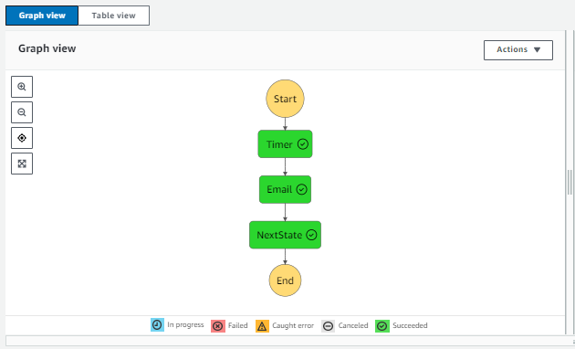
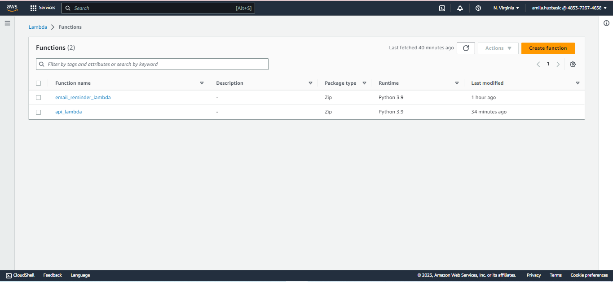
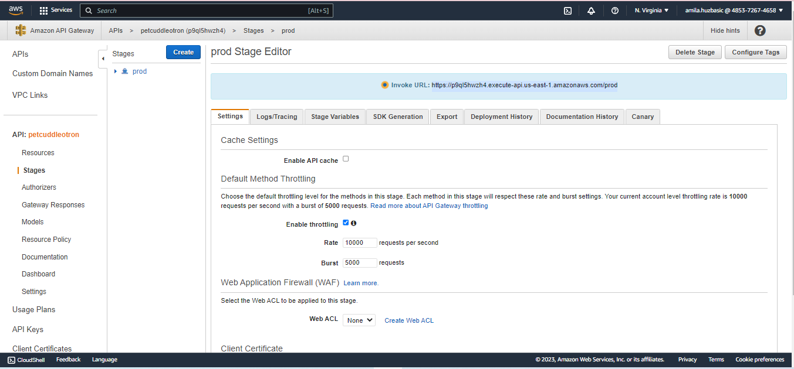
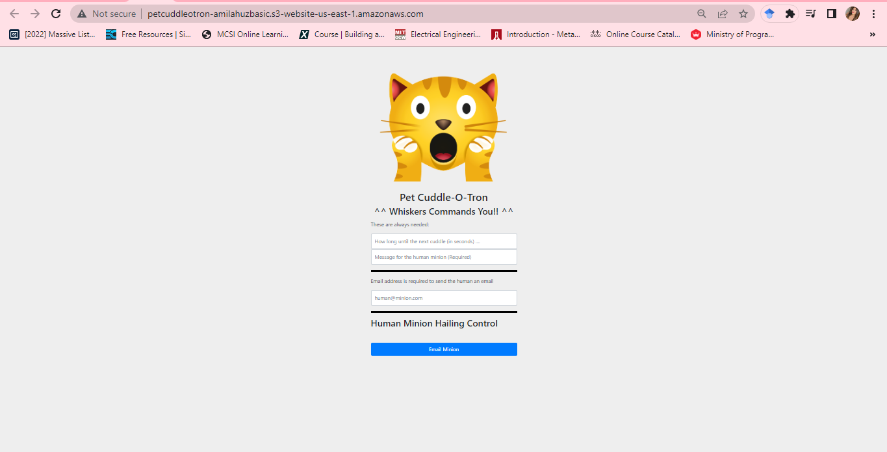
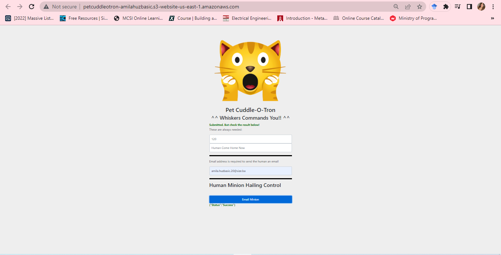
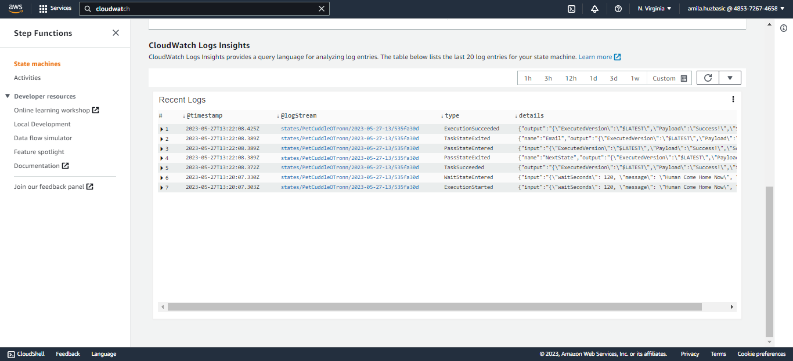

# Task 10
## Week 12
### Date: 23.05.2023


# Arhictecture Deep Dive 

### Event-Driven Architecture (EDA)

EDA  je važna za projektovanje sistema jer pruža efektivan i skalabilan pristup dizajniranju sistema. 

1. Upravljanje kompleksnosti- EDA omogućava razbijanje većih kompleksnih sistema, na manje jednostavnije komponente koje nazivamo mikroservisima. 
2. U event driven sistemima, komponente komuniciraju preko događaja. Događaj predstavlja neku značajnu promjenu ili akciju koja se dešava unutar sistema npr. klik na dugme, ažuriranje podataka u bazi i slično. Loose coupling je karakteristika EDA arhitekture. Tu komponente nisu vezane jedna sa drugom već komuniciraju putem razmjene događaja. 
3. Skalabilnost i performanse- EDA omogućava horizontalnu skalabilnost što znaći da pojedinaćne komponente mogu skalirati po potrebi. Ovakva fleksibilnost omogućava da dodamo resurse samo tamo gdje su potrebni. 
4. Reagovanje: EDA omogućava realno vrijeme reagovanja na događaje, te je obrada i donošenje odluka dosta brže. 
5. Skalabilnost: nove komponente se mogu dodati bez narušavanja ostalih

### Tiered Architecture

Tiered Arhitektura je evolucija monolitne arhitekture, gdje se monolit razbija u različite kolekcije slojeva (tier-a) pri čemu svaki sloj može da bude na različitim serverima, ili na istom, potpuno je nebitno. 

Omogućava: 
1. Nezavisno skaliranje: Svaki sloj može da skalira vertikalno. Resursi se mogu dodavati specifično u svaki sloj u zavisnosti od potreba. 
2. Korištenje load balancera: Umjesto direktnog povezivanja sa slojevima, koriste se load balanceri. Korištenjem njega dodatne instance se mogu dodavati, po potrebi, te se sva komunikacija vrši preko njih. 

Nedostaci:
1. Međusobna zavisnost slojeva: Slojevi su i dalje međusobno povezani
2. Nepotrebno opterećenje: Može dovesti do neeefikasnog korištenja resursa. 

### Queues

Korištenje redova (queues) je koncept u kojem se redovi koriste za komunikaciju između komponenti sistema. Koriste FIFO princip (fisrt in first out). Umjesto da komponente direktno komuniciraju jedna sa drugom, one ulaze u redove te se potom izvlače i obrađuju od strane odgovarajućih komponenti. 

Mogučnosti:
1. Dodavanje poruka u red: komponente mogu dodavati poruke u red, koje predstavljaju podatke i zadatke koje je potrebno uraditi. 
2. Uklanjanje poruka iz reda: komponente i procesi mogu čitati zadatke sa početka reda. Kada se poruka izvuče ona se obično obrađuje i koristi u drugim procesima. 
3. Asinkrona veza: redovi omogućavaju komponentama da komuniciraju nezavisno i bez direktnog znanja jedna o drugoj.
4. Skalabilnost: redovi omogućavaju horizontalno skaliranje jer se poruke mogu izvršavati paralelno na više instanci. (autoscaling grupe)
5. Otpornost na opterećenje: redovi mogu da skladište poruke kada je neka komponenta preopterećena ili nedostupna, čime se sprječava gubitak podataka. 

### Event-Driven Architecture

U ovoj vrsti arhitekture, sve komponente komuniciraju putem događaja. 
Događaji su promjene ili pojave unutar sistema. 

Korištenjem ove arhitekture, komponente ne moraju međusobno da komuniciraju, već koriste događaje koji se nalaze u redovima. Tako se smanjuje zavisnost između komponenti. 

Također omogučava i skalabilnost tj horizontalno skaliranje pojedinih komponenti, jer se događaji mogu izvršavati paralelno na više instanci. Otporna je na opterećenja. 

# AWS Lambda

AWS Lambda je usluga koja omogućava izvršavanje programskog koda bez brige o infrastrukturi (njezinom postavljanju i upravljanju), AWS se brine o tome. 

Ona omogućava pisanje koda u različitim jezicima kao što su Phyton, Ruby, C#, NODE, Java i slicno.

Lambda funkcije se ne izvršavaju stalno, nego samo kada je to potrebno. Funkcija se izvršava na temelju događaja koje definišemo (promjene u S3 bucketu, porukom iz queue-a, HTTP requestom ili vremenskim okicacima). 

AWS Lambda funkcija se naplaćuje na temelju broja izvršenih funkcija i vremena utrošenog da se te funkcije izvrše. Za neaktivnost se ne naplaćuje.

AWS Lambda omogućava upravljanje verzijama funkcija. To omogućava recimo testiranje novih funkcija prije nego što se postave u produkcijsko okruženje. 

Lako se može upravljati konfifuracijama postavki funkcija kao što su vremensko ogranicenje, memorija i slicno preko AWS CLI. 

 Lambda funkcije se lako integrisu sa drugim uslugama.

## Velicina paketa funkcije je ogranicena na 250MB. 

Ako je paket veci funkcija se ne moze ucitati tada radimo jednu od dvije navedene stvari: 
* Lokalna ugradnja: biblioteku preuzimamo na racunar te je ugradimo sa kodom u .zip arhivu a pritom je ugradimo u AWS Lambdu, tada ce funkcija imati sve sta joj je potrebno. 
* Spremanje u S3 Bucket: Umjesto da ga ugradujemo u .zip arhivu, mozemo je spremiti u S3 Bucket te koristiti druge alate (AWS SDK, AWS CLI) da izvuku biblioteku i koriste je u funkciji. 

Koji od ova dva nacina ce se koristiti zavisi od potreba projekta, nema univerzalnog odgovora koji je efikasniji. 

Ako je paket velik i cesto se mijenja u tom slucaju efikasnije je spremiti ga u s3 bucket, jer na taj nacin se smanjuje otpremanje cjelokupnog paketa prilikom svake promjene. 

Lokalna ugradnja pruza brze vrijeme preuzimanja jer se paket nalazi na lokalnom racunaru i ne mora se povlaciti iz S3 Bucketa. 


Vremensko vrijeme ogranicavanja lambda funkcije je 900s(15minuta). 

Lambda omogucuje koristenje env-ova. To omogućuje da unaprijed definisemo vrijednosti i koristimo ih tijekom izvrsavanja funkcije. Korisno je kada se radi o osjetljivim podacima. 

Lambda Layers: Oni omogućuju dijeljenje koda ,biblioteka i resursa između više funkcija. Smanjuje dupliciranje koda. 

Integracija sa X-Rayom. Lambda funkcije se mogu integrisati sa X-Rayom kako bi se olaksalo pracenje performansi i pronalazenje problema. 

## VPC INTEGRACIJA

VPC- Virtual Private Cloud.

To je virtuelna mreža na cloudu koja omogucava da se izloriaju i kontrolisu resursi u aws-u. 

Kada se Lambda integrise sa VPC-om, omogućava joj se pristup unutar nase privatne mreze, te ona moze komunicirati sa drugim resursima (baza podataka i slicno). 
Ovakav vid dize razinu sigurnosti jer lambda funkcija moze da pristupi samo resursima koji su joj dostupni unutar VPC mreze. 

Cloud Watch prikuplja informacije kao sto su broj izvrsavanja, vrijeme izvrsavanja, kolicina rezervisane memorije i slicno za Lambda funkcije. 

Cloud Watch Logs - tu se lambda logovi generisu.

Ako se desi greska prilikom izvrsavanja Lambda funkcije, Lambda usluga automatski pokusava ponovo je izvrsiti. Broj ponovnih izvrsavanja i vremensko ogranicenje izmedu njih se moze konfigurisati. 

Lambda funkcije mogu biti pozvane na 2 nacina: sinhrono i asinhrono. Sinhroni pozivi cekaju zavrsetak izvrsavanja funkcije i vracaju rezultat odmah. Asinhroni pozivi vracaju rezultat odmah dok se funkcija izvrsava u pozadini. 

## CloudWatch Events i EventBridge

Koriste se za upravljanje događajima i automatizaciju. 

1. Cloud Watch Events:

Omogućuju prancenje promjena i akcija u aws-u.

Mozemo generisati evente tako sto cemo dodjeliti pravila (event rules) , izvore dogadaja (event sources ) i akcije. 

Akcije definisu ono sta ce se desiti kada se event pokrene (izvrsavanje lambda funkcija, pokretanje ec2 instanci, izvodenje skripti).

Omogućuje gledanje promjena u stvarnom vremenu, kao i integraciju sa drugim uslugama. 

Cloud Watch Eventima se može upravljati preko AWS CLI-a.

Koristi JSON format za prestavljanje dogadaja. Neki od atributa koje koristi su: 

* Version: verzija formata
* ID: id dogadaja
* DetailType: vrsta dogadaja 
* Source: izvor dogadaja. usluga koja generise dogadaj.
* Time: kada se dogodilo
* Resources: resursi koji su povezani sa dogadajem
* Detal: specificne informacije za dogadaj. 

AWS Cloud Events omogućuje stvaranje inteligentnih automatizacija.

2. EventBridge

Usluga koja se gradi na Cloud Eventu i pruza naprednije usluge. 

Omogućava prikupljanje dogadaja iz third party aplikacija za obradivanje u AWS-u.

Pruza naprednije mogucnosti filtriranja u odnosu na AWS Cloud Events.

Ima napredniju logiku, te omogucuje definisanje slozenijih pravila.

Omogucuje prikupljanje i generisanje velikog broja dogadaja iz razlicitih izvora.


# Serverless Architecture

Serverless je način izgradnje i upravljanja aplikacijama bez da imamo potrebu da se brinemo o infrastrukturama i serverima. 

FaaS (Function as a service)- glavi gradivni blok serverless arhitekture. 

Imaju okidače: okidači su događaji koji pokreću izvršavanje funkcije. To mogu biti HTTP zahtjevi, promjene koje se dešavaju na nekom drugom servisu i slicno. 

Naplata: naplata se vrši po potrošnji resursa. 

# SNS (Simple Notification Service)

SNS je usluga za slanje poruka i obavjesti. 

Topic: tema za slanje poruka u SNS-u. Moze se stvoriti tema za poseban dogadaj. Kada se pošalje poruka na temu, SNS dostavlja poruku svim subscriberima.

Subscriber: to su primatelji koji primaju poruke. Moze biti email, broj, HTTP endpoint, Lambda funkcija i sl. 

Publisher: entitet koji šalje poruku na SNS temu. Može biti aplikacija, neka druga usluga ili bilo koji izvor. 

Acknowledgment Mechanisms: SNS koristi mehanizme za potrvrdu isporuke i obrade poruke. 

Filtri poruka: SNS sadrži mogućnost filtriranja poruka, tako da se može postaviti ograničenje da npr samo određeni pretplatnici dobijaju obavijesti.

Obavijesti o dostavi: SNS ima mogućnost primanja obavijestenja o dostavi putem Cloud Watcha i SNS DS teme. 

# Pet Cuddle-o-Tron mini project

Ova web aplikacija je napravljena koristeći Step funkcije, Lambda, API Gateway i S3 Static Web Hosting.


Steps: 
1. Creating SES
2. Verifikacija emaila


3. Creating email reminder lambda function


Koristimo kod [email_reminder_lamdba.py](demo_code/email_reminder_lambda.py)

4. State machine


``` 
{
  "Comment": "Pet Cuddle-o-Tron - using Lambda for email.",
  "StartAt": "Timer",
  "States": {
    "Timer": {
      "Type": "Wait",
      "SecondsPath": "$.waitSeconds",
      "Next": "Email"
    },
    "Email": {
      "Type": "Task",
      "Resource": "arn:aws:states:::lambda:invoke",
      "Parameters": {
        "FunctionName": "arn:aws:lambda:us-east-1:485372674658:function:email_reminder_lambda",
        "Payload": {
          "Input.$": "$"
        }
      },
      "Next": "NextState"
    },
    "NextState": {
      "Type": "Pass",
      "End": true
    }
  }
}

```



4. Creating email reminder lambda function



Koristimo kod: [api_lamdba.py](demo_code/api_lambda.py)

5. Kreiranje REST API, resursa i POST METODE



Deploy API to prod.

6. Aplikacija



7. Testiranje success






# Simple Queue Service (SQS)

AWS Simple Queue Service (SQS) je usluga koja omogućuje slanje i primanje poruka između različitih dijelova aplikacija. 

Kako SQS radi?

 Koristi red za pohranu poruka koje se trebaju obraditi, a zatim poseban program čita i obrađuje te poruke.

## Primjer: 
web aplikacija za slanje email-a:

Kada korisnik pošalje e-poštu, umjesto da je odmah šaljete, stavljate je u poseban "sandučić" nazvan "EmailQueue".

Zatim imate poseban program koji čita e-pošte iz tog sandučića i šalje ih stvarnim primateljima. Taj program radi odvojeno od same web aplikacije kako bi se fokusirao samo na slanje e-pošte.

Kada program primi e-poštu iz sandučića, šalje je primatelju i potom uklanja iz sandučića.

Ako se dogodi neka pogreška prilikom slanja e-pošte, e-pošta se može vratiti natrag u sandučić kako bi se pokušala ponovno poslati kasnije.

Ključne stvari za SQS:

1. Pouzdanost: poruke ce biti sigurno smještene u red

2. Skalabilnost: Može se prilagoditi različitim opterećenjima. Redovi se prilagodavaju velikom broju poruka.

3. Asinkrona komunikacija: SQS omogućuje asinkronu komunikaciju između komponenti aplikacija. To znači da se pošiljatelji poruka i primatelji poruka ne moraju međusobno sinkronizirati, što olakšava razvoj skalabilnih i otpornih aplikacija.

4. Redoslijed isporuke: FIFO redovi (First-In-First-Out) osiguravaju da se poruke isporučuju primateljima točno jedanput i u istom redoslijedu u kojem su poslane. 

5. Vidljivost poruka: Kada se poruka pošalje na red, postaje vidljiva primateljima. Primatelji mogu preuzeti i obraditi poruku, a tijekom tog procesa poruka postaje nevidljiva za ostale primatelje. To sprječava da se poruka obradi više puta.

6. Vremenski raspon zadržavanja: Možete konfigurirati vremenski period zadržavanja poruke u redu. Ako primatelj ne obradi poruku unutar tog vremenskog raspona, poruka se može ponovno poslati na obradu ili se može preusmjeriti na drugi red.

7. Integracija s drugim AWS uslugama: SQS se lako integrira s drugim AWS uslugama poput AWS Lambda, Amazon S3 i Amazon EC2. To omogućuje izgradnju složenih aplikacija koje koriste različite servise zajedno.

IAM Policy : 
```
{
  "Version": "2012-10-17",
  "Statement": [
    {
      "Effect": "Allow",
      "Action": [
        "sqs:SendMessage",
        "sqs:ReceiveMessage",
        "sqs:DeleteMessage"
      ],
      "Resource": "arn:aws:sqs:region:account-id:queue-name"
    }
  ]
}
```
Primjer IAM policy-a za slanje, brisanje i primanje poruka sa određenog reda. 

