# Task 11
## Week 13
### Date: 29.05.2023

1. Potrebno je napraviti novi enviroment na Cloud 9. Naziv enviromenta je "gitflow-workshop" a sve ostale postavke ostaviti na default.

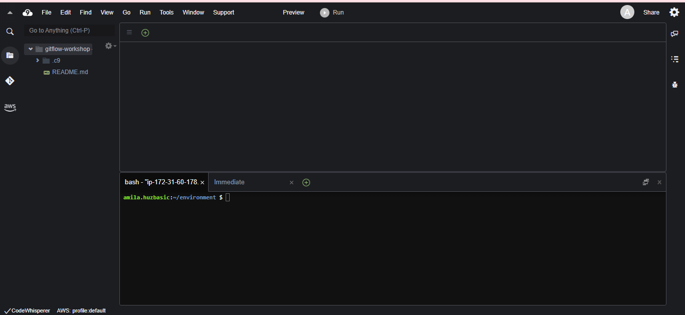

Defaultna veličina EBS diska je 10GB. 

Elastic Block Store (EBS) je virtuelni disk koji se koristi za pohranu podataka u AWS-u. 

Komanda kojom možemo provjeriti veličinu diska:

> df -h

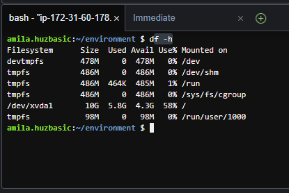

2. Promjena veličine EBS-a

Dokumentacija o promjeni veličine EBS-a se nalazi [ovdje](https://docs.aws.amazon.com/cloud9/latest/user-guide/move-environment.html#move-environment-resize).


Unutar env-a pravimo file sa nazivom resize.sh

> touch resize.sh

Otvorimo resize.sh file i kopiramo skriptu iz dokumentacije: 

``` 
#!/bin/bash

# Specify the desired volume size in GiB as a command line argument. If not specified, default to 20 GiB.
SIZE=${1:-20}

# Get the ID of the environment host Amazon EC2 instance.
INSTANCEID=$(curl http://169.254.169.254/latest/meta-data/instance-id)
REGION=$(curl -s http://169.254.169.254/latest/meta-data/placement/availability-zone | sed 's/\(.*\)[a-z]/\1/')

# Get the ID of the Amazon EBS volume associated with the instance.
VOLUMEID=$(aws ec2 describe-instances \
  --instance-id $INSTANCEID \
  --query "Reservations[0].Instances[0].BlockDeviceMappings[0].Ebs.VolumeId" \
  --output text \
  --region $REGION)

# Resize the EBS volume.
aws ec2 modify-volume --volume-id $VOLUMEID --size $SIZE

# Wait for the resize to finish.
while [ \
  "$(aws ec2 describe-volumes-modifications \
    --volume-id $VOLUMEID \
    --filters Name=modification-state,Values="optimizing","completed" \
    --query "length(VolumesModifications)"\
    --output text)" != "1" ]; do
sleep 1
done

#Check if we're on an NVMe filesystem
if [[ -e "/dev/xvda" && $(readlink -f /dev/xvda) = "/dev/xvda" ]]
then
  # Rewrite the partition table so that the partition takes up all the space that it can.
  sudo growpart /dev/xvda 1

  # Expand the size of the file system.
  # Check if we're on AL2
  STR=$(cat /etc/os-release)
  SUB="VERSION_ID=\"2\""
  if [[ "$STR" == *"$SUB"* ]]
  then
    sudo xfs_growfs -d /
  else
    sudo resize2fs /dev/xvda1
  fi

else
  # Rewrite the partition table so that the partition takes up all the space that it can.
  sudo growpart /dev/nvme0n1 1

  # Expand the size of the file system.
  # Check if we're on AL2
  STR=$(cat /etc/os-release)
  SUB="VERSION_ID=\"2\""
  if [[ "$STR" == *"$SUB"* ]]
  then
    sudo xfs_growfs -d /
  else
    sudo resize2fs /dev/nvme0n1p1
  fi
fi
```

Nakon što skriptu sacuvamo, pokrenemo komandu:

> bash resize.sh 30

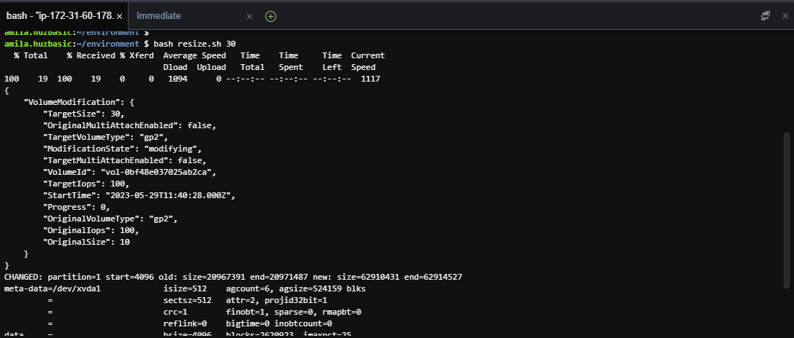

Sada kada provjerimo veličinu EBS-a, vidjet ćemo da je on 30GB.

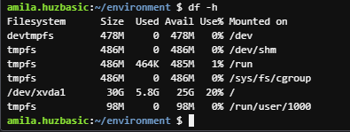

3. Initial setup

* AWS CLI CREDENTIAL HELPER

Nakon postavljanja Cloud9 enviromenta, može se postaviti AWS CLI credential helper da upravlja pristupnim podacima za CodeCommit repozirtorij. 

Ova komanda konfiguriše Git da koristi AWS CodeCommit credential helper za upravljanje pristupnim podacima:

> git config --global credential.helper '!aws codecommit credential-helper $@'

Ova komanda postavlja Git da koristi HTTP putanje za autentifikaciju s CodeCommit repozitorijima:

> git config --global credential.UseHttpPath true

4. Gitflow 

Gitflow je način organizovanja i upravljanja razvojom softvera uz pomoć Git-a.

    * Master branch- stabilna verzija softvera koja ide na produkciju. Samo provjeren i testiran kod ide na ovu granu. 

    * Develop branch- Glavna grana za razvoj softvera. Novi kod se integrira tu i provjerava da li je stabilan

    * Feature branch- Svaka nova funkcionalnost se razvija u zasebnoj grani. Kada je funkcionalnost gotova, spaja se nazad u develop brench.

    * Relase branch- Pripremaju se za objavu novih verzija softvera. Ovdje se obavljaju zadnje pripreme, testiranje i ispravke grešaka prije objave. Kada je sve spremno, spaja se u master branch i develop branch.

    * Hotfix branch- Koriste se za hitne popravke grešaka u objavljenoj verziji. Grana se odvaja od master grane, greške se ispravljaju, a zatim se spaja natrag u master branch i develop branch.

Instalacija: 

> curl -OL https://raw.github.com/nvie/gitflow/develop/contrib/gitflow-installer.sh

> chmod +x gitflow-installer.sh

> sudo git config --global url."https://github.com".insteadOf git://github.com

>sudo ./gitflow-installer.sh

## AWS Cloudformation

### Elastic Beanstalk

    * Elastic Beanstalk vam omogućava brzo postavljanje web aplikacija bez potrebe za ručnim konfiguriranjem infrastrukture. Sve što trebate je specificirati svoju aplikaciju i Elastic Beanstalk će automatski kreirati potrebne resurse.

    * Elastic Beanstalk automatski pokreće virtualne servere (EC2 instance), balansere opterećenja (load balancere) i ostale resurse potrebne za vašu aplikaciju. 

    * Elastic Beanstalk može automatski skalirati vašu aplikaciju prema promjenama u opterećenju. To znači da će se broj EC2 instanci automatski prilagođavati kako bi se održala performansa i dostupnost vaše aplikacije, bez potrebe za ručnim upravljanjem skaliranjem.

1. Kreiranje code commit repo

> aws codecommit create-repository --repository-name gitflow-workshop --repository-description "Repository for Gitflow Workshop"

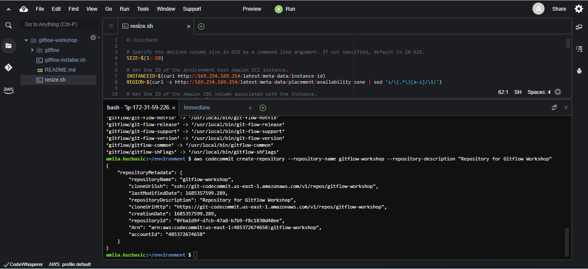

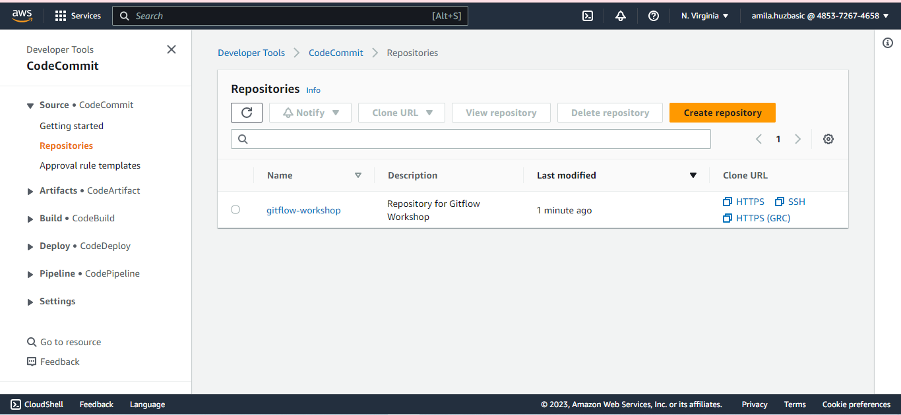

Nakon toga kloniramo repozirotij komandom 

> git clone https://git-codecommit.eu-central-1.amazonaws.com/v1/repos/gitflow-workshop 

2. Download-ujemo aplikaciju 

> ASSETURL="https://static.us-east-1.prod.workshops.aws/public/442d5fda-58ca-41f0-9fbe-558b6ff4c71a/assets/workshop-assets.zip"; wget -O gitflow.zip "$ASSETURL"


Nakon toga unzipujemo je:

> unzip gitflow.zip -d gitflow-workshop/

Promijenimo direktorij u lokalni direktorij repo-a:

> cd gitflow-workshop

Uradimo komandu git add da stage-am promjene:

> git add -A

Za kraj, commitamo i pushamo sve promjene: 

``` 

git commit -m "Initial Commit"
git push origin master

```

Da bi koristili ElasticBeanstalk prvo treba da kreiramo aplikaciju, koja će reprezentirati web app u AWS-u. 

U Elastic Beanstalku aplikacija služi kao kontejner za env koji rade na web apk, verzije koda, konfiguracije, logove i slicno. 

    *** Elastic Beanstalk application - think of it as a folder that will hold the components of your Elastic Beanstalk

    S3 bucket for artifacts - place to put your application code before deployment ***

Komanda za stvaranje Cloud Formation stack-a:

> aws cloudformation create-stack --template-body file://appcreate.yaml --stack-name gitflow-eb-app

* aws cloudformation create-stack: Ovo je osnovna sintaksa naredbe za stvaranje CloudFormation stack-a.

* template-body file://appcreate.yaml: Ova opcija specificira tijelo predloška (template) koji će se koristiti za stvaranje stack-a. U ovom slučaju, koristi se datoteka "appcreate.yaml" koja se nalazi u trenutnom direktoriju. Predložak sadrži definiciju resursa i konfiguraciju koji će biti izgrađeni i konfigurirani tijekom stvaranja stack-a.

* stack-name gitflow-eb-app: Ova opcija određuje naziv stack-a koji se kreira. U ovom primjeru, stack će se nazvati "gitflow-eb-app".

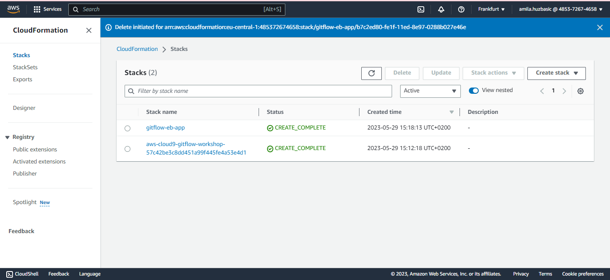

U Elastic Beanstalku aplikacija je kreirana:

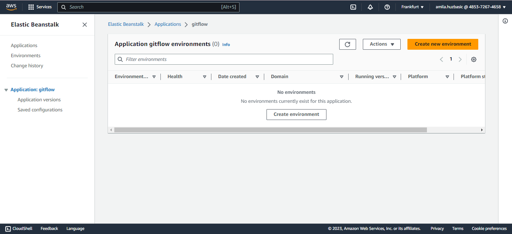

## Master Enviroment

Kada je riječ o AWS Elastic Beanstalk-u, "environment" predstavlja odvojenu instancu ili verziju vaše aplikacije koju pokreće Elastic Beanstalk.

Može se kreirati više okruženja (environments) kada želite pokrenuti više verzija iste aplikacije ili imati različita okruženja za razvoj, integraciju i produkciju.

    Možete kreirati više okruženja (environments) kada želite pokrenuti više verzija iste aplikacije ili imati različita okruženja za razvoj, integraciju i produkciju.

Karakteristike: 

* Više verzija aplikacije: Elastic Beanstalk vam omogućava da pokrenete više verzija vaše aplikacije u odvojenim okruženjima. Na primjer, možda želite imati jedno okruženje za razvoj, jedno za testiranje integracije i jedno za produkcijsku verziju aplikacije. Svako okruženje ima zasebne resurse i postavke konfiguracije.

* Odvojene instance: Svako okruženje je odvojena instanca vaše aplikacije koja je izolirana od drugih okruženja. To znači da promjene i greške u jednom okruženju neće utjecati na druga okruženja. Možete imati različite konfiguracije, poput različitih veličina instanci ili postavki skaliranja, za svako okruženje.

* Kontrola nad fazama razvoja: Imajući različita okruženja za razvoj, integraciju i produkciju, imate bolju kontrolu nad fazama razvoja aplikacije. Možete testirati promjene u integracijskom okruženju prije nego što ih implementirate u produkcijsko okruženje, osiguravajući stabilnost i pouzdanost vaše aplikacije.

* Izolacija resursa: Svako okruženje ima vlastite resurse, uključujući virtualne servere, balansere opterećenja i druge infrastrukturne komponente koje su potrebne za vašu aplikaciju. To osigurava da resursi jednog okruženja ne utječu na druge, što može poboljšati performanse i pouzdanost vaše aplikacije.

AWS Komanda za stvaranje stacka gitflow-eb-master:

> aws cloudformation create-stack --template-body file://envcreate.yaml --parameters file://parameters.json --capabilities CAPABILITY_IAM --stack-name gitflow-eb-master

Pri kreiranju dobijamo error:

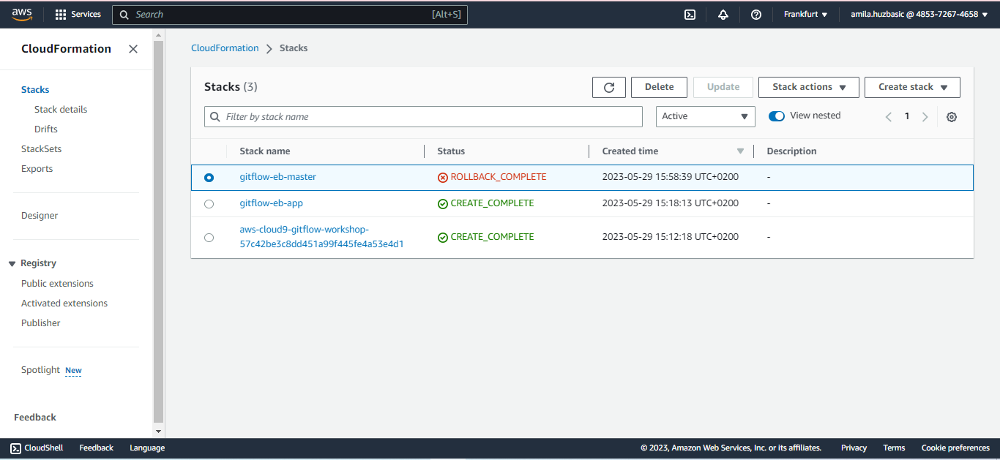

Potrebno je promijeniti verziju Node.js-a na onu koja je podrzana unutar envcreate.yaml i buildspec.yml

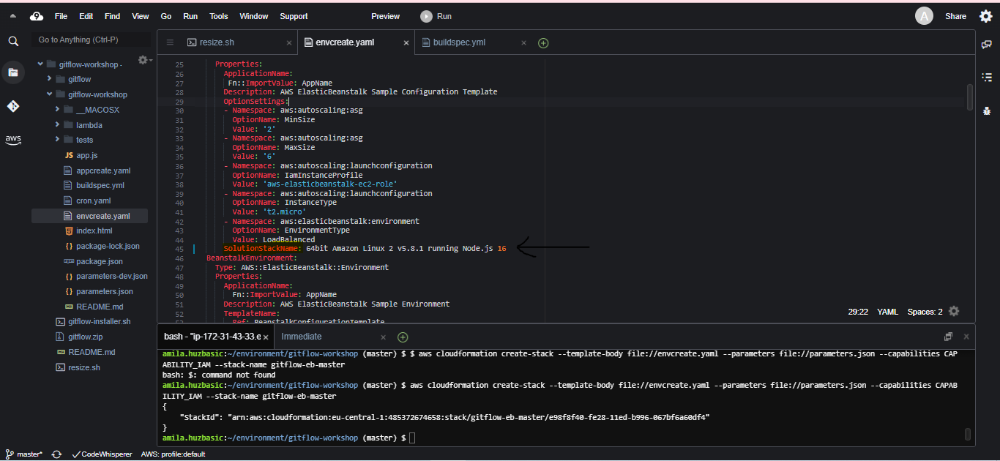

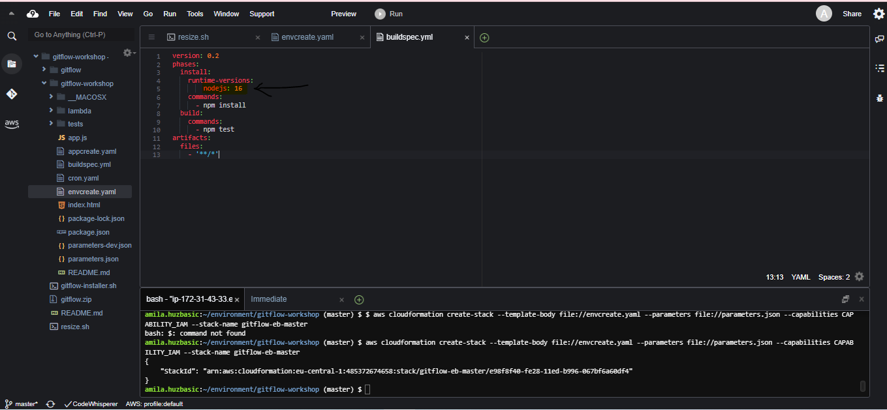

Kreirati IAM rolu pod nazivom aws-elasticbeanstalk-ec2-role i zakaciti sve permisije vezane za EB Koraci dostupni na [linku](https://docs.aws.amazon.com/elasticbeanstalk/latest/dg/iam-instanceprofile.html#iam-instanceprofile-create).

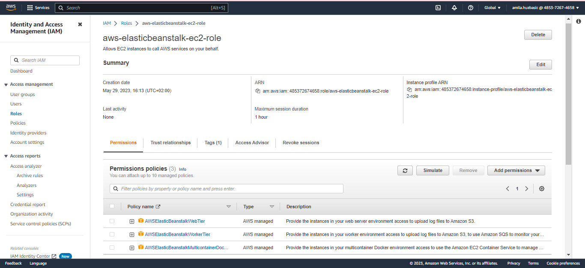

Nakon toga sve je proslo uspjesno: 

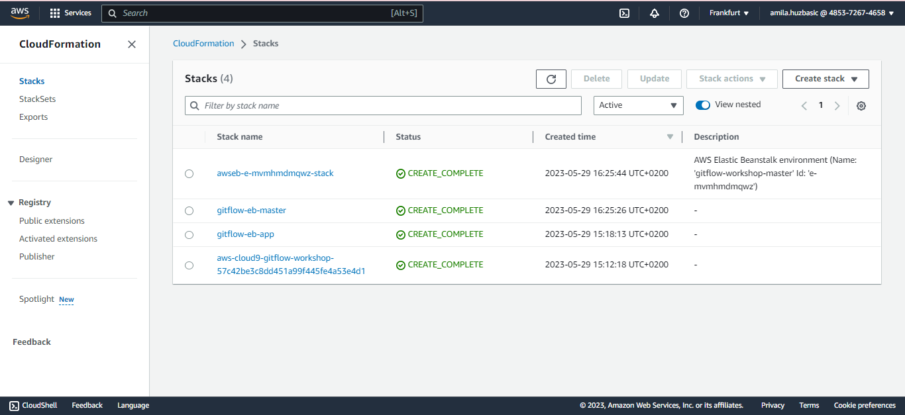

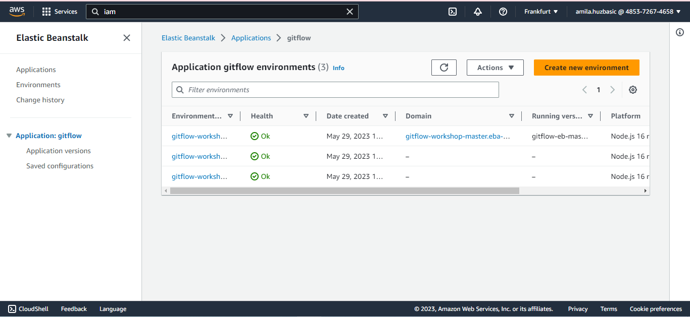

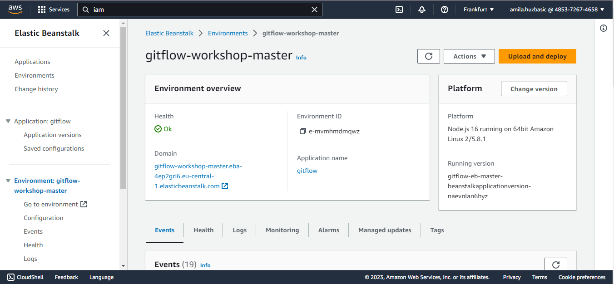


